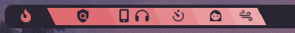

# linxjourney ⚔️

## Setup: 
 $~~~~~~~~~~~$ 
* Install mpv,powerprofiles,feh,rofi,kitty,dunst,polybar,networkmanager,polkit-kde-agent,picom,blueman.
* Install [FiraCode Nerd Fonts](https://www.nerdfonts.com/font-downloads), **pacman -S ttf-firacode-nerd**
* Install gohu-nerd **pacman -S ttf-gohu-nerd**
* copy all files on your .config folder and make all sh file executable: /polybar/script/* and subfolder, /rofi/rofitodo.sh, i3/scripts/* and subfolders.
* To use my colorscheme in vim put:  **source "PATH to"/.config/kitty/mycolorscheme.vim** in your .vimrc

#### Note: lofi and wind button take some seconds to start 5-8s
